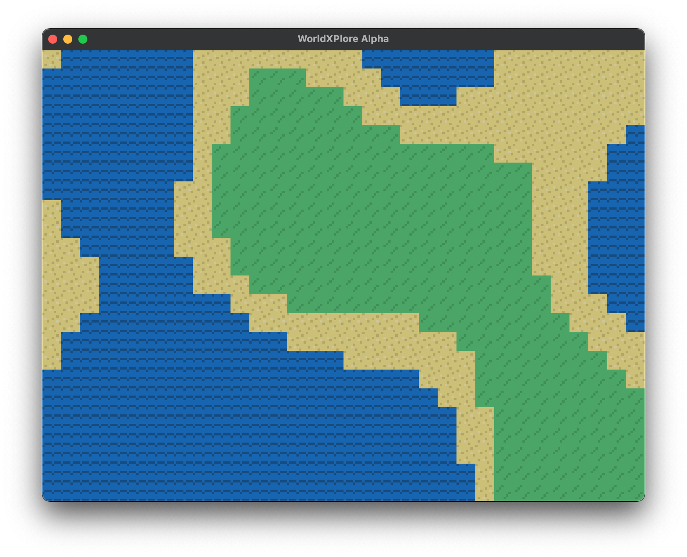
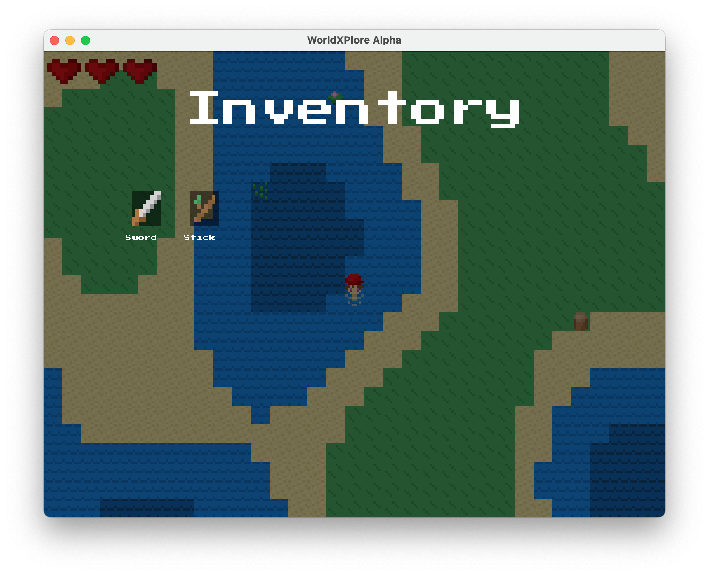

# 👾  WorldXPlore Alpha  🗺
Randomly generated 2D world, built with [Rust](https://www.rust-lang.org) and [WGPU](https://github.com/gfx-rs/wgpu-rs).

  
  

## 🎮  Gameplay
*As of right now, only keyboard controls are supported. Controller and touch controls may be implemented later.*

WorldXPlore is a 🛠 work in progress 🛠 game about exploring a randomly generated world, gathering resources, and surviving.

WASD controls can be used to move the character around the world. Inventory can be accessed with E, and the game can be paused with ESC, where you can access world saving/loading, and quitting. Interacting with tiles is not yet implemented.

## 🖥  Supported Platforms
| Platform | Status |
|----------|--------|
| Mac OS   | ✅ Tested |
| Windows  | 🤷 Untested, Should Work |
| Linux    | 🤷 Untested, Should Work |
| Android  | ❌ Not Yet Supported |
| iOS      | ❌ Not Yet Supported |

Compiled MacOS bundles in .app format are available under [releases](https://github.com/jamesbmadden/worldxplore/releases). Windows and Linux should be able to compile, but it is not tested.