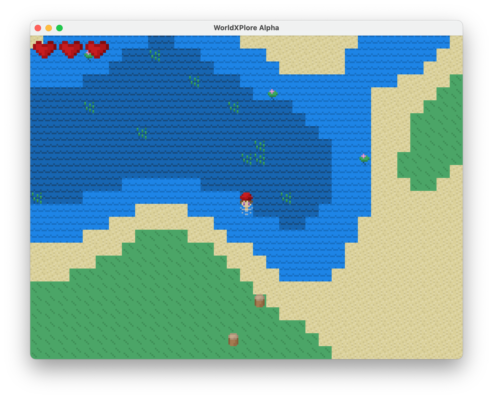

# WorldXPlore Alpha
Randomly generated 2D world, built with [Rust](https://www.rust-lang.org) and [WGPU](https://github.com/gfx-rs/wgpu-rs).

## 🎮  Gameplay
*As of right now, only keyboard controls are supported. Controller and touch controls may be implemented later.*

WorldXPlore is a 🛠 work in progress 🛠 game about exploring a randomly generated world, gathering resources, and surviving.

WASD controls can be used to move the character around the world. Interacting with tiles is not yet implemented.

## Supported Platforms
| Platform | Status |
|----------|--------|
| Mac OS   | ✅ Tested |
| Windows  | 🤷 Untested, Should Work |
| Linux    | 🤷 Untested, Should Work |
| Android  | ❌ Not Yet Supported |
| iOS      | ❌ Not Yet Supported |
